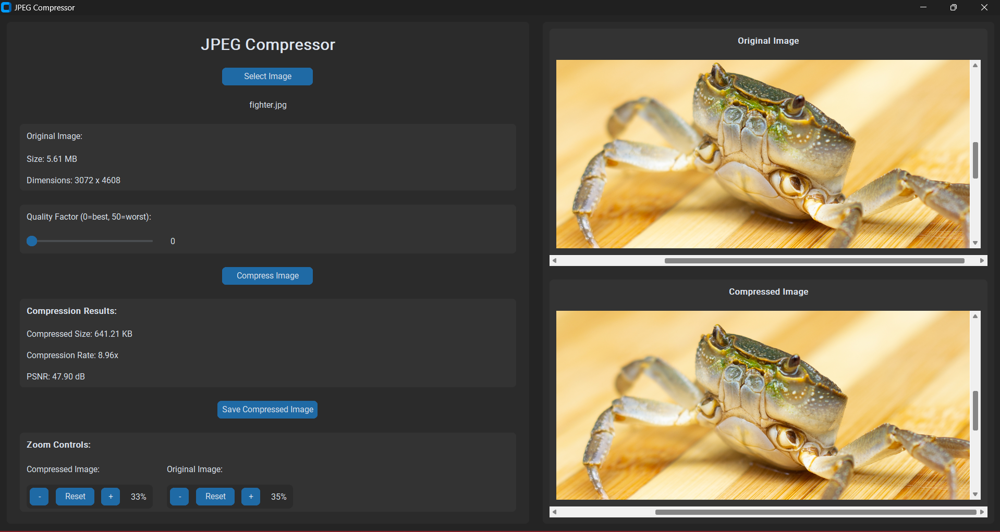

# JPEG Compressor

A modern desktop application for JPEG image compression with a customizable interface built using CustomTkinter.



## Overview

JPEG Compressor provides a visual and interactive way to compress images using the JPEG algorithm. The application allows you to see both the original and compressed images side by side, adjust compression quality, and view detailed statistics about the compression results.

## Features

- **User-friendly Interface**: Clean and modern UI with dark mode support
- **Image Selection**: Easy file selection dialog to choose images
- **Quality Control**: Adjustable compression quality (0-50, where 0 is best quality)
- **Compression Statistics**: View original size, compressed size, compression ratio, and PSNR
- **Visual Comparison**: View original and compressed images side by side
- **Save Functionality**: Save compressed images to your computer

## Requirements

- Python 3.7 or higher
- CustomTkinter library
- NumPy
- Pillow (PIL)
- Matplotlib

## Installation

1. Clone this repository or download the source code

```bash
git clone https://github.com/islamdev2022/TP4-JPEG-Compressor-TNM2.git
cd TP4-JPEG-Compressor-TNM2
```

2. Install the required libraries

```bash
pip install customtkinter numpy pillow matplotlib
```

3. Run the application

```bash
python Compressor.py
```

## Usage

1. **Launch the Application**: Run the script to start the application
2. **Select an Image**: Click "Select Image" to choose a JPEG, PNG, or other supported image file
3. **Adjust Quality**: Use the slider to set the compression quality (0 = best quality, 50 = worst quality)
4. **Compress**: Click "Compress Image" to process the image
5. **View Results**: The original and compressed images will be displayed side-by-side with compression statistics
6. **Save**: Click "Save Compressed Image" to save the compressed version to your computer

## Understanding the Compression Parameters

- **Quality Factor**: Controls the amount of information discarded during compression
  - Lower values (closer to 0) produce higher quality but larger files
  - Higher values (closer to 50) produce lower quality but smaller files
- **PSNR (Peak Signal-to-Noise Ratio)**: Measures the quality of the compressed image compared to the original
  - Higher PSNR values indicate better quality (typically 30-50 dB is good)
- **Compression Rate**: The ratio of original file size to compressed file size
  - Higher values mean more effective compression

## Understanding JPEG Compression

The application implements the JPEG compression algorithm, which works through the following detailed process:

### Encoding Process:

1. **Color Space Conversion**: Converting RGB colors to YCbCr (Y = luminance, Cb and Cr = chrominance)
   - The human eye is more sensitive to changes in brightness (Y) than color (Cb, Cr)
   - This separation allows for more efficient compression

2. **Chroma Subsampling**: Downsampling chrominance components 
   - Usually in 4:2:0 format, where color resolution is halved both horizontally and vertically
   - Reduces data volume with minimal perceptual quality loss

3. **Block Division**: Dividing the image into 8x8 pixel blocks
   - Each component (Y, Cb, Cr) is processed separately in 8x8 blocks
   - This size balances computational efficiency and compression effectiveness

4. **Discrete Cosine Transform (DCT)**: Converting spatial data to frequency domain
   - Transforms each 8x8 block into frequency components
   - Separates low-frequency information (more important visually) from high-frequency details
   - Results in one DC coefficient (average value) and 63 AC coefficients per block

5. **Quantization**: Reducing precision of the DCT coefficients
   - Each coefficient is divided by a value from a quantization table
   - Higher quality settings use smaller divisors (preserving more information)
   - This is the primary lossy step in JPEG compression
   - Different quantization tables are used for luminance (Y) and chrominance (Cb, Cr)
   - Higher frequencies (bottom-right of block) are quantized more aggressively

6. **Zigzag Scanning**: Reordering coefficients 
   - Traverses the 8x8 block in a zigzag pattern from top-left to bottom-right
   - Groups low-frequency coefficients (more important) at the beginning
   - Higher frequencies (often zero after quantization) clustered at the end
   - Optimizes for the next step by creating longer runs of zeros

7. **Run-Length Encoding (RLE)**: Compressing sequences of identical values
   - Particularly effective for the many zero values that appear after quantization
   - Encodes each non-zero AC coefficient with its value and the number of zeros preceding it
   - Special "end of block" (EOB) markers indicate when remaining coefficients are all zeros

8. **Huffman Coding**: Further compressing the data
   - Creates variable-length codes based on frequency of symbols
   - More common values get shorter codes
   - Different Huffman tables are used for DC and AC coefficients
   - DC coefficients are encoded as the difference from the previous block (DPCM)

### Decoding Process:

1. **Huffman Decoding**: Translating Huffman codes back to original symbols
   - Uses the same Huffman tables that were used during encoding

2. **Run-Length Decoding**: Expanding compressed runs
   - Converts (zero count, value) pairs back to original sequences with zeros

3. **Inverse Zigzag Scan**: Rearranging coefficients back to 8x8 blocks
   - Places coefficients back in their original positions in the frequency domain block

4. **Dequantization**: Multiplying coefficients by quantization values
   - Reverses the quantization step by multiplying each coefficient by its corresponding quantization table value
   - Cannot fully recover lost precision (lossy compression)

5. **Inverse DCT (IDCT)**: Converting from frequency domain back to spatial domain
   - Transforms frequency coefficients back to pixel values
   - Results in an approximation of the original 8x8 pixel block

6. **Color Space Conversion**: Converting YCbCr back to RGB
   - Combines the decompressed Y, Cb, and Cr components
   - Upsamples chrominance components if they were downsampled
   - Maps the result back to RGB color space for display

### Factors Affecting Compression:

1. **Quality Factor**: Controls the quantization tables
   - Lower values produce higher quality but larger files
   - Higher values produce smaller files but lower quality

2. **Image Content**: Different types of images compress differently
   - Images with smooth areas and fewer details compress better
   - Images with many sharp edges and high-frequency details compress less efficiently

3. **Chroma Subsampling Ratio**: Different subsampling options
   - 4:4:4 = No chroma subsampling (highest quality)
   - 4:2:2 = Horizontal subsampling only
   - 4:2:0 = Both horizontal and vertical subsampling (most common)

4. **Original Image Size**: If the original image Dimensions are big the duration of the compression will be take too long, around 5 minutes for images that are 3000x4000

The JPEG compression algorithm achieves significant file size reduction while maintaining reasonable visual quality by exploiting limitations in human visual perception, especially our reduced sensitivity to high-frequency details and color variations.

## Troubleshooting

- **Image Not Loading**: Make sure the image is in a supported format (JPG, PNG, BMP, etc.)
- **Error During Compression**: Some very large images may cause memory issues. Try a smaller image or resize the existing one
- **Poor Visual Quality**: Adjust the quality slider closer to 0 for better visual results

## License

This project is licensed under the MIT License - see the LICENSE file for details.

## Acknowledgments

- This application uses the CustomTkinter library for modern UI elements
- The JPEG compression algorithm implementation is based on standard image processing techniques

## Contact

For any questions or feedback, please open an issue on the GitHub repository or contact me 